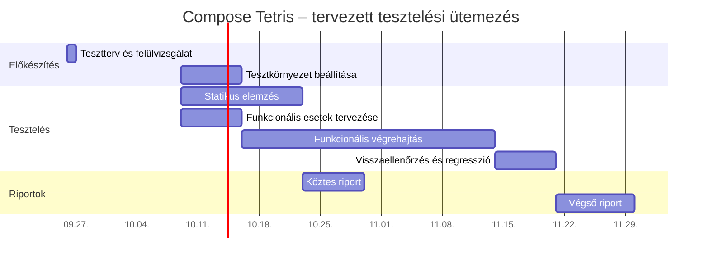

# Tesztterv – Compose Tetris

## Dokumentumadatok 

**Dokumentumazonosító:** ALPHA-TETRIS-IN1091LA8  
**Dátum:** 2026.10.09. 
**Tantárgy:** Szoftvertesztelés összevont színtér gy.  
**Félév:** 2026/2027. I. félév  
**Verzió:** 1.3-tervezet 
**Állapot:** csapatfelülvizsgálatra és jóváhagyásra előkészített tervezet.

**Készítők:**

- Acsai Gergő, tesztelő – `@h446322`
- Bartl Bálint, tesztelő – `@h449633`
- Juhász Ferenc Márk, tesztelő – `@h469636`
- Kamarás Levente, tesztelő – `@h470575`
- Komáromi Norbert László, tesztelő és kapcsolattartó – `@h265679`
- Szabó Larion, tesztelő – `@h377633`

**Verziótörténet:**

| Verzió | Kiadás dátuma | Leírás |
|---|---|---|
| 1.0-tervezet | 2026.09.26. | Az első kitöltött munkaváltozat elkészítése. |
| 1.1-tervezet | 2026.09.26. | Átdolgozás a hivatalos Test Plan minta fejezetei és sorrendje szerint. |
| 1.2-tervezet | 2026.10.09. | A külön helyi példány JUnit/IntelliJ-környezeti kiegészítése. |
| 1.3-tervezet | 2026.10.09. | Az 1.2 JUnit-kiegészítéseinek átvétele; igazolt forrás/buildverzió, hétfői határidők, súlyos statikus találatok követelménye, részletes teszttermékek és javított kapacitásszámítás. |

**Kapcsolódó GitLab-issue:** https://git-okt.sed.inf.szte.hu/softwaretesting2026/in1091la8/alpha/-/issues/1  
**A tesztterv elkészítésének becsült ráfordítása:** 18 személyóra, az issue-ban is rögzítendő.  
**Dokumentum tervezett helye:** `docs/`.

**Alkalmazott minta:** [SZTE – Test Plan](https://okt.inf.szte.hu/tesztalap/gyakorlat/test_plan/). A tartalom Compose Tetrisre szabott tervezet; a munkamegosztás és a becslések a csapat által véglegesítendők. A dokumentum ChatGPT segítségével készült; a felhasznált promptok és a közreműködés leírása a [kiegészítő munkanyagban](Compose_Tetris_Kiegeszitesek.md) található.

## Bevezetés 

Ez a dokumentum az ALPHA csapat által a 2026/2027. tanév Szoftvertesztelés kurzusához választott **Compose Tetris** alkalmazás teszttervét tartalmazza.

A [Compose Tetris](https://github.com/vitaviva/compose-tetris) Kotlin nyelven, Jetpack Compose felhasználói felülettel készített, nyílt forráskódú Android-játék. A játékos különböző alakzatokat mozgat és forgat a pályán. A teljesen kitöltött sorok eltűnnek, ezért pont jár; a törölt sorok számával a nehézségi szint is emelkedik. A felület kijelzi a pontszámot, a sorok számát, a szintet, a következő alakzatot és a rendszeridőt. A játék szüneteltethető, újraindítható, a hanghatások némíthatók.

**A tesztelés célja** a működési hibák és a kódminőségi problémák feltárása, különösen a mozgatás, forgatás, ütközés, sortörlés, pontozás és játékállapot-kezelés területén. **A tesztelési feladat** statikus kódelemzés és funkcionális tesztelés végrehajtása, az eredmények értékelése és dokumentálása.

A statikus vizsgálat az `app` modul saját Kotlin-forráskódjára, manifestjére és kapcsolódó erőforrásaira terjed ki. Kiemelt részei a `GameViewModel.kt`, `Spirit.kt`, `Brick.kt`, `Utils.kt` és `MainActivity.kt`. A generált kódot és a külső könyvtárak belső implementációját nem elemezzük saját kódként.

A funkcionális tesztelés az Android-alkalmazás játéklogikáját és kezelőfelületét vizsgálja. Tesztbázisként a projekt README-jét, az elérhető forráskódot és az ezek alapján egyeztetett elvárt működést használjuk. A dokumentációban nem rögzített viselkedést a végrehajtás előtt tisztázzuk; a jelenlegi implementáció önmagában nem igazolja a helyességet. Például a kód a sortörlési pontokon felül alakzatonként 12 pontot ad, és 10-ben korlátozza a szintet.

**Tesztelt verzió:** az upstream `234416c455cd0b5524b7f2a7e91aaa9f6206457a` commitja alapján készült `software/compose-tetris` másolat. A main források változatlanok; a tesztfüggőségek és a helyi JUnit-csomag kiegészítések. Az APK SHA-256 és fájlonkénti forrásazonosítás a [környezeti leírásban](Compose_Tetris_Kornyezet.md) szerepel. Új GitLab-commit még nincs, mert a csapat maga végzi a commitot és push-t.

## Feltételezések és korlátozások 

A teljes forrásprojektet beszereztük; a próbabuild sikeres. A működő Androidos futtatás külön ellenőrzendő, az ADB eszközlistája 2026.10.09-én üres volt. A korábbi szöveges forráskivonat hiánya ezért már nem buildblokkoló, az emulátor/eszköz hiánya továbbra is funkcionális korlát.

A csapat mind a hat tagjának hozzá kell férnie a GitLab-projekthez. Legalább egy megfelelő fejlesztői gépet és két Android-emulátorprofilt tervezünk használni. Fizikai telefonon további ellenőrzés végezhető, ha rendelkezésre áll ilyen eszköz.

Kizárólag az Android-alkalmazás kiválasztott verzióját teszteljük. Nem része a feladatnak a külső szolgáltatások és könyvtárak teljes vizsgálata, szerveres terhelésmérés vagy átfogó biztonsági audit. A feltárt hibák dokumentálását vállaljuk; valamennyi hiba javítása nem feltétele a tesztelési projekt lezárásának.

A véletlen alakzatsorrend és a magas szintek elérése megnehezítheti egyes tesztek előkészítését. Ezekhez reprodukálható pályaállapotokat és dokumentált debug-előkészítést tervezünk. Tesztsegéd jelenleg nincs igazoltan rendelkezésre állóként kezelve; ha szükséges, külön feladatban készül, változatlan játékszabályokkal. Tesztadatként személyes vagy érzékeny adatot nem használunk.

## Kommunikáció 

Az oktatóval hivatalos egyetemi e-mail-címen és a kurzus CooSpace-felületén kommunikálunk. Nyilvános kurzuskérdések a fórumra kerülhetnek; személyes ügyeket e-mailben egyeztetünk.

A feladatokat, becsléseket, hibákat és döntéseket GitLab-issue-kban vezetjük. A dokumentumok és kódbeli módosítások a közös repóba kerülnek. Minden issue-nak van felelőse és állapota; a tényleges ráfordítást a munkát végző tag rögzíti.

A gyors csapatkommunikációhoz közös Discord-csatornát javasolunk. Hetente egy 20–30 perces megbeszélést tartunk, amelyről rövid emlékeztető készül. A szokásos válaszidő 24–48 óra; a munkát blokkoló problémákat az észlelés napján jelezzük. A kapcsolattartó Komáromi Norbert László.

## Kockázatkezelés 

A kockázatok bekövetkezési esélyét és súlyosságát egyaránt Alacsony (1) – Közepes (2) – Magas (3) skálán értékeljük. A két érték szorzata adja a **kockázati szintet**: 1–2 pont Alacsony, 3–4 pont Közepes, 6 pont Magas, 9 pont Kritikus kockázatot jelent.

**Termékkockázatok és kezelési tervük:**

| ID | Termékkockázat | Bekövetkezés esélye | Súlyosság | Kockázati szint | Kezelési terv |
|---|---|---|---|---|---|
| PR1 | A játék nem telepíthető, nem indul, vagy rendszeresen összeomlik | Közepes | Magas | Magas | Tiszta emulátoron telepítési és indítási próba; Logcat mentése, az indítást akadályozó hibák elsőbbsége. |
| PR2 | Hibás mozgatás, forgatás vagy ütközésvizsgálat | Közepes | Magas | Magas | Pályaszéli, pályaalji és foglalt mezős esetek; valamennyi alakzattípus ellenőrzése. |
| PR3 | Hibás sortörlés, pontozás vagy szintváltás | Közepes | Magas | Magas | Előkészített pályák 1–4 sor törléséhez; pontváltozás és 19/20, 39/40, 179/180 soros határok ellenőrzése. |
| PR4 | Szünet, újraindítás, animáció vagy háttérbe lépés hibás játékállapotot okoz | Közepes | Magas | Magas | Állapotátmenetek, gyors bemenetek és háttérből visszatérés vizsgálata; reprodukciós videó készítése. |
| PR5 | Egyes készülékeken hibás a kijelzés vagy a hangkezelés | Közepes | Közepes | Közepes | Második emulátorprofil használata; némítás, újranyitás, pont- és szintkijelzés ellenőrzése. |
| PR6 | A statikus elemzés téves konfiguráció miatt hamis pozitív vagy hamis negatív találatokat ad | Közepes | Közepes | Közepes | Az elemzőeszköz próbafuttatása ismert hibán; a találatok kézi átvizsgálása és a szabálykészlet felülvizsgálata. |
| PR7 | Az alakzatgenerátor nem egyenletesen sorsol, egyes alakzatok ritkábban vagy egyáltalán nem jelennek meg | Alacsony | Közepes | Alacsony | Hosszabb mintavétel naplózása a generált sorrendről; eloszlás statisztikai ellenőrzése. |
| PR8 | Magas szinten vagy gyors, egymást követő bemenetek mellett a játék lassul vagy akad | Közepes | Közepes | Közepes | Mérés az elsődleges emulátoron különböző szinteken; a bemenetfeldolgozás és a rajzolás elkülönített vizsgálata. |
| PR9 | Képernyő-elforgatás vagy egyéb konfigurációváltozás (pl. téma, nyelv) elveszíti a játékállapotot | Közepes | Magas | Magas | Forgatás és konfigurációváltás tesztelése futó és szüneteltetett állapotban; pálya és pontszám megmaradásának ellenőrzése. |
| PR10 | A rendszeróra kijelzése hibás vagy nem frissül percfordulónál, illetve időzóna-eltérést mutat | Alacsony | Alacsony | Alacsony | Az óra ellenőrzése eszközidő módosításával és percforduló körüli megfigyeléssel. |

**Projektkockázatok és kezelési tervük:**

| ID | Projektkockázat | Bekövetkezés esélye | Súlyosság | Kockázati szint | Kezelési terv |
|---|---|---|---|---|---|
| JR1 | Betegség vagy egyéb elfoglaltság miatt csökken a kapacitás | Közepes | Közepes | Közepes | Feladatok és állapotuk közös nyilvántartása, helyettes kijelölése, szükség szerinti újraosztás. |
| JR2 | ZH-k és más beadandók miatt csúszik a munka | Magas | Közepes | Magas | Belső határidők, heti egyeztetés, kritikus feladatok korai elvégzése és 8 személyóra tartalék. |
| JR3 | Régi függőségek, hiányos projekt vagy eszköz-inkompatibilitás akadályozza a munkát | Magas | Magas | Kritikus | Korai próbabuild és próbaelemzés, működő verziók dokumentálása; két nap elakadás után oktatói egyeztetés. |
| JR4 | Az elemzés vagy az összetett játékállapotok előállítása több időt igényel a becsültnél | Közepes | Közepes | Közepes | Korai próba a kritikus eseteken; tesztadatok megosztása, becslések felülvizsgálata. Kevés statikus találat esetén kiegészítő eszköz és oktatói egyeztetés. |
| JR5 | GitLab-kiesés vagy nem megfelelő verzió használata miatt elveszik a nyomon követhetőség | Alacsony | Közepes | Alacsony | Helyi repómásolat, rendszeres commit, buildazonosítók rögzítése; kiesés után a jegyzetek szinkronizálása. |
| JR6 | Eltérő fejlesztői gépeken (JDK, Gradle, Android SDK verzió) a build nem reprodukálható | Közepes | Magas | Magas | Rögzített eszközverziók dokumentálása; Gradle wrapper használata; eltérés esetén környezet-egyeztetés a csapaton belül. |
| JR7 | Egyes csapattagoknál nincs megfelelő gép vagy virtualizációs támogatás az emulátorhoz | Alacsony | Közepes | Alacsony | Fizikai eszköz vagy megosztott/távoli fejlesztői gép igénybevétele; feladatok újraosztása a rendelkezésre álló eszközök szerint. |
| JR8 | A csapaton belüli kommunikáció lassú, a vállalt 24–48 órás válaszidő rendszeresen csúszik | Alacsony | Közepes | Alacsony | Heti megbeszélés emlékeztetőinek követése; blokkoló ügyek azonnali Discord-jelzése a kapcsolattartó felé. |
| JR9 | Az MI-segédlettel készült tartalom (becslések, javaslatok) pontatlan, és a csapat nem veszi észre időben | Közepes | Közepes | Közepes | Minden MI-generált rész csapattársi felülvizsgálata elfogadás előtt; eltérés esetén saját forrás alapján javítás. |
| JR10 | Az oktatói elvárások vagy értékelési szempontok menet közben pontosodnak/változnak | Alacsony | Közepes | Alacsony | Rendszeres CooSpace/fórum-ellenőrzés; változás esetén a tesztterv és issue-k gyors átvezetése, verziófrissítés. |

A kockázatokat a heti megbeszélésen áttekintjük. A koordinátor gondoskodik a felelős kijelöléséről és a kezelési intézkedések nyomon követéséről.

## Tesztmegközelítés

### Teszttípusok 

Két tesztelési feladatot végzünk:

- **Statikus kódelemzés:** az alkalmazás forrásának és erőforrásainak eszközös elemzése, a találatok kézi értékelésével.
- **Funkcionális tesztelés:** a működő Android-alkalmazás rendszerszintű, elsősorban manuális és feketedoboz-jellegű vizsgálata.

A statikus kódelemzés statikus tesztelési technika; a funkcionális tesztelés dinamikus tesztelés. Az esetleges javításokat megerősítő teszttel, az érintett működést regressziós tesztekkel ellenőrizzük. A játéklogikát kiegészítő helyi JUnit-egység- és integrációs tesztek támogatják; ezek nem helyettesítik a vállalt 25/50 Androidos funkcionális esetet, és nem változtatják meg a két választott projektfeladatot.

### Teszttechnikák 

**Statikus vizsgálat:** Android Lint futtatása az `app` modulon, szükség esetén a projekt Kotlin-verziójával kompatibilis Detekt használata. A találatokat egyenként értékeljük: valódi probléma vagy téves pozitív jelzés, kiváltó ok, lehetséges következmény, javítási javaslat és becsült ráfordítás.

**Funkcionális vizsgálat:**

- Ekvivalenciaparticionálás: érvényes és tiltott mozgás, teljes és hiányos sor, üres és foglalt célmező.
- Határérték-elemzés: pályaszélek, pályaalj, 0–4 sor törlése és szintváltási küszöbök.
- Állapotátmenet-tesztelés: indítás, futó játék, szünet, folytatás, sortörlés, újraindítás és játék vége.
- Tapasztalatalapú vizsgálat: gyors egymás utáni bemenetek, animáció közbeni vezérlés, háttérbe lépés és visszatérés.

A tervezett készlet legalább 50 különálló esetből áll. Lefedi az indítást, vezérlést, alakzatokat, pontozást, szinteket, hangot és kijelzőket. Minden esethez előfeltétel, bemenet, pontos lépések és elvárt eredmény készül. A nehezen elérhető pályaállapotok előkészítését külön dokumentáljuk.

### Teszttermékek 

- A tesztterv és a tesztelt forrásverzió azonosítása.
- A statikus elemzés hatóköre, eszközverziói és konfigurációja.
- Nyers statikus elemzési kimenet, lehetőség szerint géppel feldolgozható XML vagy más támogatott formátumban.
- Összesítő statisztika és a félév végére legalább **10 súlyos szabálysértés** részletes értékelése, az oktatói követelmény szerint. Az első köztes triázs kisebb és téves jelzéseket is tartalmazhat, de azok nem számítanak ebbe a célértékbe.
- Legalább 50 funkcionális teszteset leírása, tesztadatai és végrehajtási jegyzőkönyve.
- Kiegészítő JUnit-tesztforrások és megőrzött nyers XML/HTML futtatási eredmények.
- GitLab-hibajegyek: bejelentő, verzió, környezet, reprodukció, várt és tényleges eredmény, súlyosság, prioritás és státusz.
- Szükséges képernyőképek, videók és naplórészletek.
- Köztes és végső riport, a végrehajtási aránnyal, sikeres/sikertelen/blokkolt esetek számával, hibastatisztikával és ismert korlátokkal.

A dokumentumokat Markdown-formátumban, a kapcsolódó bizonyítékokat azonosítóval ellátva tároljuk a csapat GitLab-repójában. Az előzetes tesztötletek és az issue-ba másolható szöveg a [kiegészítő munkanyagban](Compose_Tetris_Kiegeszitesek.md) találhatók.

### Belépési és kilépési feltételek 

**Statikus tesztelés – belépési feltételek:**

- A tesztterv jóváhagyott, a vizsgált commit és a forráskód hatóköre rögzített.
- Elérhető a teljes projekt, a kompatibilis JDK és a működő Gradle wrapper.
- Az elemzőeszköz beállított és próbaelemzéssel ellenőrzött.
- Ha a projekt eredeti állapotában nem építhető, a szükséges környezetjavítások dokumentált forkban szerepelnek.

**Statikus tesztelés – kilépési feltételek:**

- A kijelölt hatókör elemzése és az összes találat statisztikai összesítése elkészült.
- Legalább 10 különálló **súlyos szabálysértés** részletesen elemzett: valódiság, ok, következmény, javítási javaslat és ráfordítás. A súlyosságot indokolni kell; 10 tetszőleges warning nem elég.
- Az eszközriport és az elemzés elérhető a repóban, és egy másik csapattag felülvizsgálta.

**Funkcionális tesztelés – belépési feltételek:**

- A tesztterv jóváhagyott, a várt működés és a tesztesetek rögzítettek.
- Az azonosított APK telepíthető és elindul az elsődleges tesztkörnyezetben.
- A szükséges tesztadatok és előkészített állapotok rendelkezésre állnak.
- A tesztjegyzőkönyv és a hibabejelentés módja előkészített.

**Funkcionális tesztelés – kilépési feltételek:**

- Legalább 50 különálló eset végrehajtott és sikeres vagy sikertelen eredménnyel értékelt. A blokkolt és nem futtatott esetek nem számítanak bele.
- A másodlagos környezeten az indítás, mozgatás, forgatás, ejtés, szünet/folytatás, újraindítás, egy sor törlése, némítás és visszatérés alaptesztjei is lefutottak.
- Minden feltárt hibához reprodukálható bejelentés és megfelelő bizonyíték tartozik.
- Az eredmények összesítése és a tesztjelentés elkészült.

Blokkoló hiba vagy környezetprobléma esetén az érintett eseteket felfüggesztjük, az akadályt rögzítjük, majd annak megszűnése után folytatjuk. Nyitott hibák mellett is készülhet zárójelentés; a nem teljesített kilépési feltételeket abban egyértelműen feltüntetjük.

### Tesztkörnyezet 

**Funkcionális teszteléshez:**

- Operációs rendszer: Windows 10 / 11 Pro, emulátorhoz engedélyezett virtualizációval; tervezetten legalább 16 GB RAM.
- Fejlesztőkörnyezet: Android Studio 2024.3, Android SDK, Android Emulator és ADB.
- Elsődleges emulátor: Pixel 2, Android SDK API 35, álló nézet, kb. 1080×1920 képpont.
- Másodlagos emulátor: Android 5.0 / API 21 a README szerinti minimum ellenőrzésére. A tényleges buildfájlok eltérő minimuma esetén a környezetet és a tervet módosítjuk.
- Bekapcsolható hangkimenet; képernyőkép, képernyőfelvétel és Logcat a bizonyítékokhoz.

**Statikus teszteléshez:**

- Operációs rendszer: Windows 10 / 11 Pro, Android Studio 2024.3 és Git.
- Java (JDK): a jelenlegi igazolt futtatás Eclipse Temurin 17.0.20.1+1.
- Build rendszer: a projekt Gradle wrapperje, Gradle 7.3 (7.3-rc-1).
- Android Lint; szükség esetén kompatibilis Detekt.
- Markdown-szerkesztő és GitLab a dokumentáláshoz.

**Automatizált egységtesztekhez:**

- Helyi JVM, JUnit 4.13.2, kotlinx-coroutines-test 1.6.0; tesztforrás `software/compose-tetris/app/src/test`.
- A külön 1.2-tervezet szerint IntelliJ IDEA 2026.2.3 Android/Kotlin pluginnal is használható; ezt a konkrét IDE-környezetet itt nem ellenőriztük. Az igazolt futtatás Gradle-lel történt, emulátor nélkül.
- Az `androidTest` tesztek Androidos eszközt igényelnek; ezek most nem futottak.
- Rögzített build stack: Kotlin 1.6.10, Compose 1.1.1, AGP 7.1.2, compile/target SDK 32, min SDK 21; Detekt CLI 1.23.8 típusfeloldás nélkül.

A funkcionális emulátorprofilok és IDE-k tervezett környezetek. Az igazolt környezet és a sikeres `assembleDebug`, `lintDebug`, `testDebugUnitTest` eredmények a [környezeti leírásban](Compose_Tetris_Kornyezet.md) és [tesztriportban](Compose_Tetris_Egysegtesztek.md) szerepelnek. Minden Androidos futtatás a tényleges eszközt és telepített APK-t azonosítja.

## Ütemezés 

Az alábbi diagram és táblázat a belső ütemezés 2026.10.09-i frissítése. A csapat hétfői gyakorlata és a nyilvános menetrend alapján M2: **2026.11.01. vasárnap 08:00**, bemutató november 2.; végső riport: **2026.12.06. vasárnap 08:00**. A tesztterv korábbi szeptember 28-i dátuma a szeptember 27-i vasárnap reggeli határidő helyett szerepelt. Eltérő CooSpace-közlés elsőbbséget élvez. Minden időpont budapesti helyi idő.

| Feladat | Időszak / belső határidő | Becsült ráfordítás |
|---|---|---:|
| Tesztterv és felülvizsgálat | 09.26–09.27 | 18 személyóra |
| Környezet előkészítése | 10.09–10.16 | 12 személyóra |
| Statikus elemzés és jelentés | 10.09–10.23; súlyos találatok véglegesítése M3-ig | 72 személyóra |
| Funkcionális esetek és tesztadatok tervezése | 10.09–10.16 | 36 személyóra |
| Funkcionális végrehajtás és hibajegyek | 10.16–11.14; legalább 25 eset 10.23-ig | 14 személyóra |
| Visszaellenőrzés és regresszió | 11.14–11.21 | 20 személyóra |
| Köztes riport | 10.23–10.30; leadás: 11.01 08:00 | 36 személyóra |
| Végső riport | 11.21–11.30; leadás: 12.06 08:00 | 18 személyóra |
| Kiegészítő JUnit-csomag | 10.09–10.12 | 12 személyóra |
| M2 dokumentumfelülvizsgálat | 10.23–10.30 | 4 személyóra |
| **Alapráfordítás összesen** | Eredeti 226 + 12 + 4 | **242 személyóra** |
| **Elméleti kapacitásból fennmaradó keret** | Nem ténylegesen ledolgozott idő | **178 személyóra** |
| **Korábbi képlet javított kapacitásértéke** | Csapat által még ellenőrzendő | **420 személyóra** |

A becslések a csapattagok összeadott munkaórái. A köztes riport belső célja az első statikus jelentés és legalább 25 végrehajtott funkcionális eset, a végső cél 50. Az eredeti nyolc munkacsomag becslése változatlan. A kiegészítő JUnit és külön M2-review 16 órája tervezett többlet, a riportban indokolt eltérés. A funkcionális 14 órás keret az állapot-előkészítés és bizonyítékmentés után újrabecsülendő.

A korábbi kreditből számolt elméleti kapacitásban számtani hiba volt. A használt képletet az alábbiak javítják; a kreditérték és a képlet intézményi érvényességét nem igazoltuk. A 420 óra **nem igazolt rendelkezésre álló kapacitás és nem teljesített munka**, ezért ütemezési döntést a 242 órás feladatalapú becslésre és a csapat tényleges elérhetőségére kell alapozni.

**A kiszámítás menete:**
- 2 × 2 × 14 × 6 = 336 óra, illetve
- 3 × 2 × 14 × 6 = 504 óra
- 336 + ((504-336) / 2) = 420 személyóra

A becslések a csapat felülvizsgálata után módosíthatók. A JR2-nél szereplő 8 óra a minimálisan fenntartandó operatív tartalék, nem a teljes elméleti maradványkeret.

## Felelősségi körök 

Az alábbi munkamegosztás tervezett; a tényleges hozzájárulásokat a GitLab-feladatokban és riportokban rögzítjük.

| Név | Felelősség |
|---|---|
| Acsai Gergő | Statikus találatok értékelése; sortörlési, pontozási és szintváltási tesztek. |
| Bartl Bálint | Környezetbeállítás, verziók és APK azonosítása, statikus eszközök futtatása. |
| Juhász Ferenc Márk | Mozgatás, forgatás, ütközés és ejtés funkcionális tesztjei. |
| Kamarás Levente | Állapotváltások, szünet, újraindítás és Android-életciklus tesztjei. |
| Komáromi Norbert László | Koordináció, kapcsolattartás, issue-k, becslések, határidők és dokumentumfelülvizsgálat szervezése. |
| Szabó Larion | Hang- és kijelzőtesztek, bizonyítékok rendezése, metrikák és riportok összesítése. |

Helyettesítési és felülvizsgálati párok: Acsai Gergő–Bartl Bálint; Juhász Ferenc Márk–Kamarás Levente; Komáromi Norbert László–Szabó Larion. Minden fontos jelentést a szerzőn kívül legalább egy csapattárs ellenőriz.

## Jóváhagyó 

**Jóváhagyásra kijelölt személy:** Dr. Tóth László, gyakorlatvezető.  
**Jóváhagyás állapota:** függőben.  
**Jóváhagyás dátuma:** a tényleges jóváhagyás után rögzítendő.  
**Jóváhagyás hivatkozása:** a kapcsolódó GitLab- vagy CooSpace-bejegyzés, amikor rendelkezésre áll.
